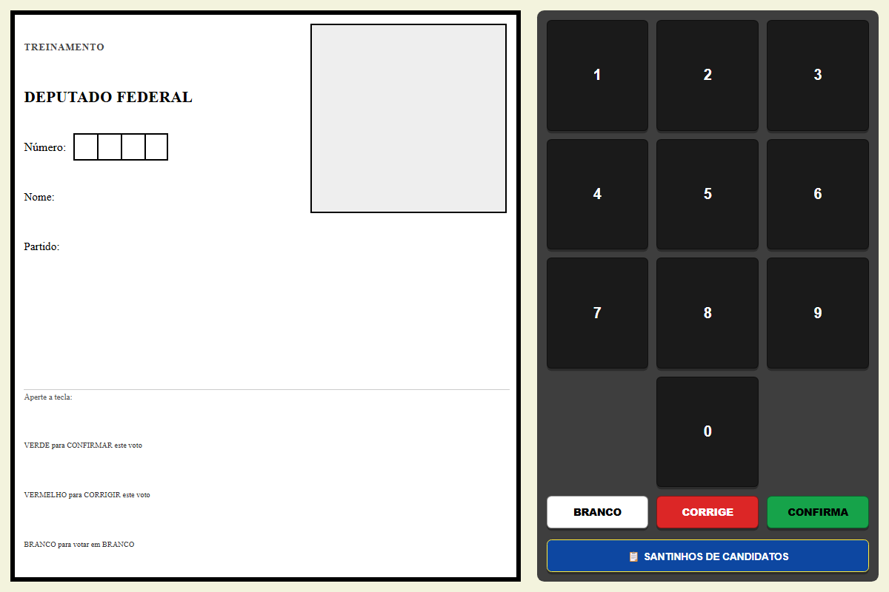
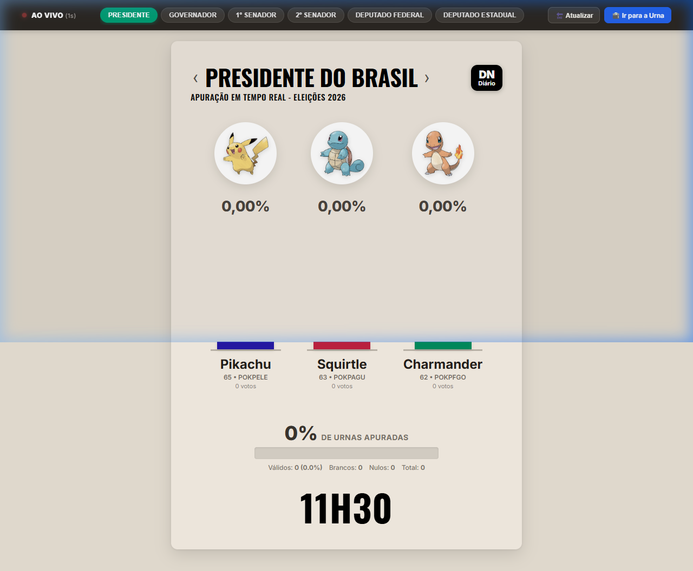
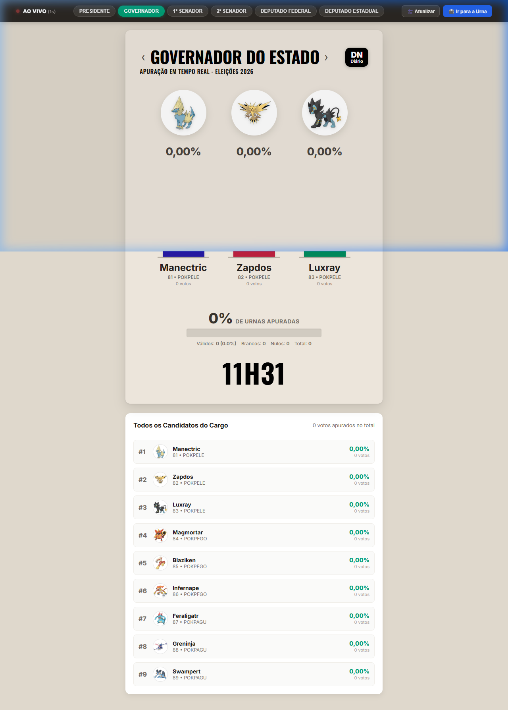

# 🗳️ Urna Eletrônica Pokémon • Eleições 2026

<div align="center">


**Sistema completo de votação eletrônica inspirado no padrão oficial do Tribunal Superior Eleitoral (TSE) com temática Pokémon.**  
Desenvolvido em arquitetura 100% Web (HTML5, CSS3, JavaScript Vanilla + API RESTful PHP + MySQL/MariaDB).

[🌐 Acessar Demonstração Online](https://luiz0067yahoo.github.io/ESP32-Urna-Eletronica/frontend) • [📖 Guia de Hospedagem](#-implantao-em-hospedagem-tradicional-cpanel--hostinger--locaweb) • [🧪 Suíte de Testes](#-suite-de-testes--simuladores-tests) • [🔌 Documentação da API](#-documentao-da-api-restful)

</div>

---

## 📑 Sumário

- [Visão Geral](#-viso-geral)
- [Demonstração e Telas do Sistema](#-demonstrao-e-telas-do-sistema)
- [Funcionalidades Principais](#-funcionalidades-principais)
- [Estrutura do Repositório](#-estrutura-do-repositrio)
- [Implantação em Hospedagem Tradicional (cPanel / Hostinger / Locaweb)](#-implantao-em-hospedagem-tradicional-cpanel--hostinger--locaweb)
- [Execução Local (XAMPP / WampServer / PHP CLI)](#-execuo-local)
- [Banco de Dados & Povoamento Oficial](#-banco-de-dados--povoamento-oficial)
- [Documentação da API RESTful](#-documentao-da-api-restful)
- [Suíte de Testes & Simuladores (`tests/`)](#-suite-de-testes--simuladores-tests)
- [DevOps e Contêineres (Opcional)](#-devops-e-contineres-opcional)
- [Licença e Créditos](#-licena)

---

## 🔍 Visão Geral

A **Urna Eletrônica Pokémon** reproduz com fidelidade milimétrica a experiência cívica de votar em uma eleição oficial brasileira:
- **Cabine de Votação Digital:** Interface com teclado numérico de alta precisão, visor LCD eletrônico, fotos dos candidatos, colinha eleitoral e efeitos sonoros característicos (bip de digitação e trissono de FIM do TSE).
- **Painel de Apuração em Tempo Real:** Layout cinematográfico inspirado na cobertura eleitoral de televisão, exibindo barras verticais proporcionais, relógio digital dinâmico, apuração das seções e fotos oficiais dos candidatos.
- **Backend Robusto & Leve:** API RESTful modular em PHP compatível com qualquer servidor web compartilhado, sem dependências de frameworks pesados, com suporte nativo a banco de dados MySQL ou MariaDB.

---

## 📸 Demonstração e Telas do Sistema

### 1. Cabine de Votação (Urna Eletrônica)
*Visor digital, botões interativos `BRANCO`, `CORRIGE`, `CONFIRMA`, feedback por áudio e preenchimento ordenado de todos os 6 cargos eletivos.*



### 2. Apuração ao Vivo • Presidente da República
*Gráficos verticais com fotos oficiais da PokeAPI, totalização percentual em tempo real e destaque visual para os líderes da votação.*



### 3. Apuração ao Vivo • Governador do Estado
*Navegação dinâmica entre cargos (Presidente, Governador, Senador 1 e 2, Deputado Federal e Deputado Estadual).*



---

## ✨ Funcionalidades Principais

- 🗳️ **Fluxo Eleitoral Oficial (6 Cargos em Sequência):**
  1. Deputado Estadual *(5 dígitos)*
  2. Deputado Federal *(4 dígitos)*
  3. 1º Senador *(3 dígitos)*
  4. 2º Senador *(3 dígitos)*
  5. Governador *(2 dígitos)*
  6. Presidente da República *(2 dígitos)*
- ⌨️ **Validador de Entrada por Software:** Controle rigoroso de máscara de dígitos, tecla `BRANCO`, cancelamento com `CORRIGE` e gravação com `CONFIRMA`.
- 🔊 **Efeitos Sonoros Originais:** Áudio sintetizado via Web Audio API para reproduzir o tom de digitação e o sinal de encerramento da urna.
- 📡 **Envio Resiliente de Votos:** Transmissão automática via requisições HTTP `POST` para a API, com fallback gracioso para votação local na ausência de conexão.
- 🔄 **Polling Dinâmico na Apuração:** A tela de apuração sincroniza a cada 5 segundos com a base de dados, atualizando as métricas sem necessidade de recarregar a página.

---

## 📁 Estrutura do Repositório

```text
ESP32-Urna-Eletronica/
│
├── index.php                     # 🚀 Ponto de entrada raiz (redireciona para frontend/index.html)
├── apuracao.php                  # 📊 Atalho raiz para o painel de apuração ao vivo
├── .htaccess                     # ⚙️ Regras do Apache (DirectoryIndex, MIME types e proteção de .env)
├── README.md                     # 📖 Documentação oficial completa
│
├── frontend/                     # 🌐 Aplicação Web do Usuário (Cliente)
│   ├── index.html                # Tela da Urna Eletrônica (Cabine de Votação)
│   ├── apuracao.html             # Painel de Apuração Eleitoral em Tempo Real
│   ├── urna.js                   # Script de compatibilidade da cabine
│   ├── css/                      # Estilos visuais (Design responsivo e temático)
│   │   ├── style.css             # Regras globais de layout e tipografia
│   │   ├── urna.css              # Gabinete da urna, tela LCD e teclado numérico
│   │   ├── apuracao.css          # Estilo card eleitoral de TV, barras verticais e relógio
│   │   └── santinhos.css         # Modal de colinha eleitoral dos candidatos
│   └── js/                       # Lógica de controle e regras eleitorais
│       ├── urna.js               # Gerenciador da urna (máscara de dígitos, áudio e transmissão)
│       ├── apuracao.js           # Gerenciador de apuração (polling, gráficos e porcentagens)
│       ├── partidos.js           # Lista oficial de legendas e siglas partidárias Pokémon
│       ├── candidatos/           # Base modular de candidatos por cargo eletivo
│       │   ├── candidato.js      # Modelo de dados Candidato
│       │   ├── presidentes.js    # Candidatos a Presidente
│       │   ├── governadores.js   # Candidatos a Governador
│       │   ├── senadores_1.js    # Candidatos a 1º Senador
│       │   ├── senadores_2.js    # Candidatos a 2º Senador
│       │   ├── deputados_federais.js  # Candidatos a Deputado Federal
│       │   └── deputados_estaduais.js # Candidatos a Deputado Estadual
│       └── artes/                # Ilustrações PokeAPI de alta resolução
│
├── backend/                      # ⚙️ API RESTful em PHP
│   ├── index.php                 # Roteador central da API (/votos, /apuracao, /status)
│   ├── route.php                 # Motor de roteamento HTTP leve e independente
│   ├── conecta.php               # Gerenciador de conexão PDO com MySQL (lê config.php ou .env)
│   ├── config.example.php        # Modelo de configuração para hospedagens compartilhadas
│   ├── .env.example              # Modelo de variáveis de ambiente
│   ├── .htaccess                 # Reescrita para URLs amigáveis
│   ├── votos/index.php           # Endpoint direto de votos (compatível sem mod_rewrite)
│   └── apuracao/index.php        # Endpoint direto de apuração (compatível sem mod_rewrite)
│
├── db/                           # 🗄️ Estrutura e Dados do Banco de Dados MySQL
│   ├── urna_eletronica.sql       # 📥 DUMP SQL COMPLETO (Importação em 1 clique via phpMyAdmin)
│   ├── install.php               # Instalador inteligente (executável via CLI ou navegador)
│   ├── migrate.php               # Criação das tabelas relacionais via PHP
│   └── seed.php                  # Povoamento inicial de partidos e candidatos oficiais
│
├── tests/                        # 🧪 Bateria de Testes, Simuladores e Auditoria
│   ├── index.html                # Dashboard visual de testes com cabine interativa e estresse
│   ├── test_sistema_api.py       # Suíte automatizada de testes de contrato da API REST
│   ├── simulador_poke.py         # Simulador de Terminal Eleitoral Digital (emissor de votos)
│   ├── simulador_eleicao_massa.py# Simulador de carga e estresse (multithread / alto tráfego)
│   ├── simulador_teclado_matricial.py # Validador de regras de dígitos e debounce de software
│   ├── run_tests.bat             # Menu interativo de testes para Windows
│   ├── run_tests.sh              # Menu interativo de testes para Linux / macOS
│   └── README.md                 # Documentação detalhada da pasta de testes
│
├── devops/                       # 🐳 Contêineres e Infraestrutura (Opcional)
│   ├── docker/                   # Dockerfile e docker-compose.yml (Apache + PHP 8.2 + MariaDB)
│   ├── podman/                   # Containerfile e podman-compose
│   └── kubernetes/               # Manifestos de Deployment, Service e Ingress
│
└── docs/                         # 🖼️ Recursos visuais da documentação
    ├── urna_eletronica.png
    ├── apuracao_presidente.png
    └── apuracao_governador.png
```

---

## 🌐 Implantação em Hospedagem Tradicional (cPanel / Hostinger / Locaweb)

O projeto foi projetado especificamente para publicar em **qualquer provedor de hospedagem web compartilhada** que ofereça **HTML, CSS, JS, PHP (7.4 ou 8.x) e MySQL / MariaDB**.

### Passo 1: Enviar os Arquivos
1. Compacte os arquivos do projeto em um arquivo `.zip` ou conecte-se via **FTP (FileZilla)**.
2. Extraia todos os arquivos diretamente na pasta raiz pública da sua hospedagem (geralmente **`public_html`** ou **`www`**).

### Passo 2: Criar o Banco de Dados no Painel da Hospedagem
1. No painel de controle (cPanel, hPanel, etc.), abra a seção **Bancos de Dados MySQL**.
2. Crie uma nova base de dados (ex: `usuario_urna`).
3. Crie um novo usuário MySQL com senha forte e vincule-o ao banco, concedendo **Todos os Privilégios** (*ALL PRIVILEGES*).

### Passo 3: Configurar as Credenciais de Acesso
Dentro da pasta `backend/`, crie um arquivo chamado **`config.php`** (você pode duplicar o [`backend/config.example.php`](backend/config.example.php)):

```php
<?php
// Configurações do Banco de Dados MySQL
define('DB_HOST', 'localhost');          // Geralmente 'localhost' na maioria das hospedagens
define('DB_NAME', 'nome_do_seu_banco');  // Nome do banco criado no cPanel
define('DB_USER', 'nome_do_seu_usuario'); // Usuário criado no cPanel
define('DB_PASS', 'sua_senha_secreta');  // Senha do usuário do banco
define('DB_PORT', '3306');
```
*(Se sua hospedagem permitir o uso de `.env`, você também pode preencher o arquivo `backend/.env`)*.

### Passo 4: Criar as Tabelas e Candidatos (Escolha 1 Opção)
- **Opção A — Pelo phpMyAdmin (Recomendado):**
  1. Acesse o **phpMyAdmin** pelo seu cPanel.
  2. Selecione o banco de dados criado na coluna lateral.
  3. Clique na aba superior **Importar**.
  4. Escolha o arquivo [`db/urna_eletronica.sql`](db/urna_eletronica.sql) e clique no botão **Executar**.
- **Opção B — Diretamente pelo Navegador:**
  Abra no seu navegador o endereço:
  `https://seusite.com.br/db/install.php`

### Passo 5: Acessar a Aplicação
- 🗳️ **Cabine de Votação (Urna):** `https://seusite.com.br/` *(ou `/frontend/index.html`)*
- 📊 **Apuração ao Vivo:** `https://seusite.com.br/apuracao.php` *(ou `/frontend/apuracao.html`)*
- 🔌 **API RESTful de Votos:** `https://seusite.com.br/backend/votos`

---

## 💻 Execução Local

### Pré-requisitos:
- Servidor local como **XAMPP**, **WampServer**, **Laragon** ou **PHP nativo (CLI)**.
- MySQL ou MariaDB ativo na porta 3306.

### Passo a Passo:
1. Clone o repositório dentro do diretório web local (ex: `htdocs` no XAMPP ou `www` no Wamp):
   ```bash
   git clone https://github.com/luiz0067yahoo/ESP32-Urna-Eletronica.git
   ```
2. Crie a base de dados `urna` no seu MySQL:
   ```sql
   CREATE DATABASE urna CHARACTER SET utf8mb4 COLLATE utf8mb4_unicode_ci;
   ```
3. Configure `backend/config.php` ou `backend/.env` com suas credenciais locais (`root` sem senha por padrão).
4. Execute o instalador automático:
   ```bash
   php db/install.php
   ```
5. Acesse no navegador:
   - Urna: `http://localhost/ESP32-Urna-Eletronica/`
   - Apuração: `http://localhost/ESP32-Urna-Eletronica/apuracao.php`

*(Ou utilize o servidor embutido do PHP: `php -S localhost:8080` e acerte a URL para `http://localhost:8080`).*

---

## 🗄️ Banco de Dados & Povoamento Oficial

O banco é estruturado em três tabelas relacionais otimizadas com índices de busca:

### 1. `partidos`
Contém as legendas eleitorais temáticas de Pokémon:
| Sigla | Nome do Partido | Slogan |
| :--- | :--- | :--- |
| **POKPELE** | Partido Organizado Karvalho Professor Elétrico | Energia e inovação para todos |
| **POKPFGO** | Partido Organizado Karvalho Professor Fogo | Chama da mudança |
| **POKPAGU** | Partido Organizado Karvalho Professor Água | Água é vida e preservação |
| **POKPPSI** | Partido Organizado Karvalho Professor Psíquico | Conhecimento, ciência e sabedoria |
| *...* | *Demais legendas temáticas* | *...* |

### 2. `candidatos`
Contém todos os concorrentes oficiais por cargo:
- **Presidente:** Pikachu (65), Squirtle (63), Charmander (62).
- **Governador:** Manectric (81), Zapdos (82), Magmortar (84), Blaziken (85), Feraligatr (87), Greninja (88), etc.
- **Senador:** Alakazam (701), Gengar (702), Dragonite (703), Mewtwo (751), Lugia (752), Ho-Oh (753).
- **Deputado Federal:** Raichu (9101), Jolteon (9102), Charizard (9201), Blastoise (9301).
- **Deputado Estadual:** Pichu (90101), Mareep (90102), Cyndaquil (90201), Totodile (90301).

### 3. `votos`
Registra individualmente cada voto recebido pela urna com data/hora e identificador do cargo.

---

## 🔌 Documentação da API RESTful

Todas as respostas são retornadas em formato `JSON` com codificação `UTF-8`.

### 1. Registrar Voto Individual
- **Rota:** `POST /backend/votos`
- **Headers:** `Content-Type: application/json`
- **Payload:**
  ```json
  {
    "cargo": "PRESIDENTE",
    "numero_candidato": "65"
  }
  ```
- **Resposta (HTTP 201):**
  ```json
  {
    "status": "success",
    "message": "Voto para PRESIDENTE computado com sucesso!",
    "id": 142
  }
  ```

### 2. Registrar Votação Completa em Lote
- **Rota:** `POST /backend/votos`
- **Payload:**
  ```json
  {
    "votos": [
      { "cargo": "DEPUTADO ESTADUAL", "numero_candidato": "90101" },
      { "cargo": "DEPUTADO FEDERAL", "numero_candidato": "9101" },
      { "cargo": "1º SENADOR", "numero_candidato": "701" },
      { "cargo": "2º SENADOR", "numero_candidato": "751" },
      { "cargo": "GOVERNADOR", "numero_candidato": "81" },
      { "cargo": "PRESIDENTE", "numero_candidato": "65" }
    ]
  }
  ```

### 3. Consultar Apuração Geral dos Votos
- **Rota:** `GET /backend/apuracao`
- **Retorno:** Total de votos por candidato, votos brancos, nulos e percentual computado.

### 4. Consultar Status do Sistema
- **Rota:** `GET /backend/status`
- **Retorno:** Status de operação da API, conexão com o banco MySQL e timestamp do servidor.

---

## 🧪 Suíte de Testes & Simuladores (`tests/`)

O repositório inclui uma pasta dedicada [`tests/`](tests/) contendo simuladores de terminal, testes de carga e testes automatizados de contrato:

| Arquivo | Descrição |
| :--- | :--- |
| **[`tests/index.html`](tests/index.html)** | 🌐 **Dashboard Visual:** Interface gráfica no navegador com terminal virtual, testes de carga com slider de eleitores e apuração em tempo real. |
| **[`tests/test_sistema_api.py`](tests/test_sistema_api.py)** | 🧪 **Validador de Contratos:** 12 casos de teste automatizados cobrindo rotas HTTP 200, 201, 400, 404, filtros e zerésima. |
| **[`tests/simulador_poke.py`](tests/simulador_poke.py)** | 🤖 **Simulador do Terminal Eleitoral:** Emula o cliente web realizando a sessão completa de votação com cálculo de latência e sons. |
| **[`tests/simulador_eleicao_massa.py`](tests/simulador_eleicao_massa.py)** | ⚡ **Teste de Carga & Estresse:** Executa centenas de votos simultâneos em paralelo com métricas de RPS e latências p95/p99. |
| **[`tests/simulador_teclado_matricial.py`](tests/simulador_teclado_matricial.py)**| ⌨️ **Validador do Teclado:** Valida as regras de negócio de contagem de dígitos por cargo, teclas especiais e debounce. |
| **[`tests/run_tests.bat`](tests/run_tests.bat)** | 🚀 Menu interativo em 1 clique para ambiente Windows. |
| **[`tests/run_tests.sh`](tests/run_tests.sh)** | 🐧 Menu interativo executável para ambiente Linux / macOS. |

### Como Executar os Testes no Terminal:
```bash
# No Windows:
tests\run_tests.bat

# No Linux / macOS:
chmod +x tests/run_tests.sh
./tests/run_tests.sh
```

---

## 🐳 DevOps e Contêineres (Opcional)

Para quem deseja rodar a aplicação em contêineres ou orquestradores modernos, a pasta [`devops/`](devops/) disponibiliza arquiteturas completas:

- **Docker Compose:**
  ```bash
  docker compose -f devops/docker/docker-compose.yml up -d
  ```
  *Sobe automaticamente o servidor Apache/PHP na porta 8080 e o banco MariaDB na porta 3306.*
- **Podman:** Suporte a Podman Compose com `devops/podman/podman-compose.yml`.
- **Kubernetes:** Manifestos declarativos em `devops/kubernetes/` prontos para deploy em cluster K8s.
- **GitHub Actions CI/CD:** Pipeline automatizado em `.github/workflows/docker-ci-cd.yml` com validação de build e publicação de imagens no GitHub Container Registry (GHCR).

---

## 📄 Licença

Este projeto é disponibilizado sob a licença **MIT** para fins educacionais, de estudo e entretenimento.  
Os personagens, nomes e artes de Pokémon são marcas registradas da **Nintendo / Creatures Inc. / GAME FREAK inc.**

---

<div align="center">
Feito com ⚡ para os fãs de Pokémon e entusiastas de sistemas eleitorais.
</div>
